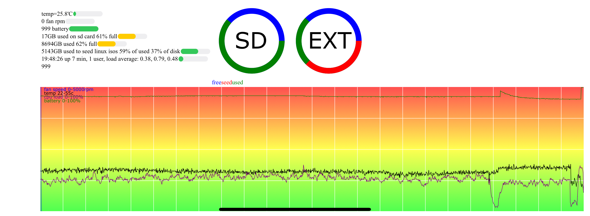

# html stats page using svg elements 
bash script to make a html webpage using svg element[^2] to show progress bars[^1], pie chart[^3] and line graph[^4] from log files[^5][^6]

will make a script to convert gps to svg image of track

[^1]:https://www.w3schools.com/TAgs/tag_meter.asp
[^2]:https://www.w3schools.com/html/html5_svg.asp
[^3]:https://www.w3schools.com/graphics/svg_circle.asp
[^4]:https://www.w3schools.com/graphics/svg_polyline.asp
[^5]:https://man7.org/linux/man-pages/man1/tail.1.html
[^6]:https://man7.org/linux/man-pages/man1/head.1.html
